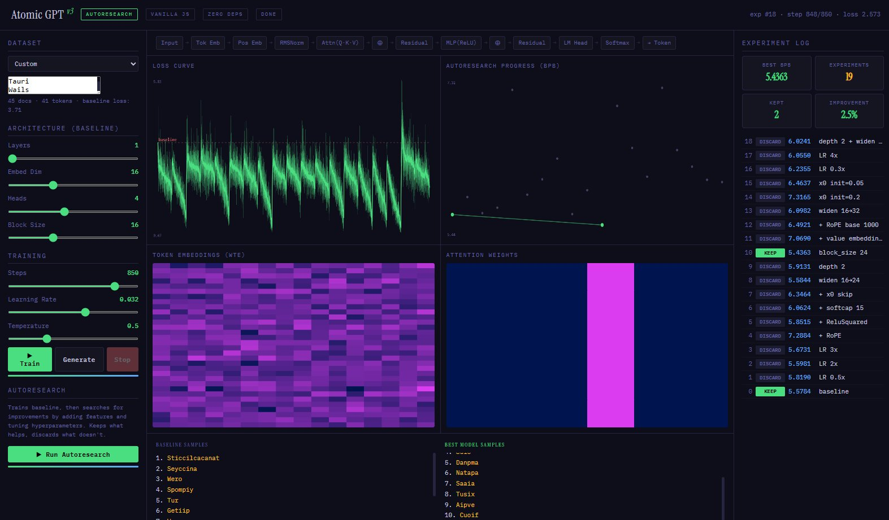

# Atomic GPT v3 — Autoresearch

A complete GPT transformer with autonomous hyperparameter optimization in a single 42 KB HTML file. Zero dependencies. Open it in a browser and click Run.

Built on [Karpathy's atomic GPT](https://gist.github.com/karpathy/) (scalar autograd, no libraries) and inspired by [autoresearch](https://github.com/karpathy/autoresearch) (autonomous experiment loop on H100). This project ports both ideas to vanilla JavaScript that runs in any modern browser.



## What It Does

**Train mode**: Trains a character-level GPT on one of five built-in datasets (or custom text), showing live loss curves, token embedding heatmaps, attention weight patterns, and generated samples.

**Autoresearch mode**: Trains a simple baseline, then autonomously tests 18 architectural and optimizer mutations — keeping improvements, discarding regressions — using bits-per-byte (BPB) as a vocabulary-independent evaluation metric. No human decisions required.

The system implements every architectural feature from Karpathy's `train.py`:

| Feature | Implementation |
|---------|---------------|
| Rotary Position Embeddings (RoPE) | Per-head cos/sin rotation of Q and K vectors |
| ReluSquared | `relu(x)²` activation in MLP |
| Logit soft-capping | `softcap * tanh(logits / softcap)` |
| Value embeddings | Second embedding lookup with per-head sigmoid-gated mixing |
| x0 skip connections | Learnable blend of layer input with post-embedding representation |
| RMSNorm | Root mean square normalization (not LayerNorm) |
| LR auto-scaling | `effective_lr = lr * sqrt(16 / n_embd)` for fair width comparison |
| Adam with bias correction | β1=0.85, β2=0.99, matching the original |

Each feature is a boolean toggle. The autoresearch loop starts from a simple baseline (no features) and adds them incrementally, evaluating each against the running best.

## Quick Start

```
# That's it. No install, no build, no server.
open atomic-gpt-v3.html
```

Or drag the file into any browser tab. Works offline.

### Train a Model

1. Select a dataset from the dropdown
2. Adjust architecture/training sliders if desired
3. Click **Train**
4. Click **Generate** to sample from the trained model

### Run Autoresearch

1. Select a dataset
2. Click **Run Autoresearch**
3. Watch the experiment log fill in (takes 5–30 minutes depending on dataset size)
4. The system will train a baseline, test 18 mutations, and keep/discard each one
5. Side-by-side comparison shows baseline vs. best model samples

## Datasets

| Dataset | Documents | Vocabulary | Notes |
|---------|-----------|-----------|-------|
| Baby Names — 32K | 32,033 | 27 | Fetched from [makemore](https://github.com/karpathy/makemore). Requires internet on first load. |
| Baby Names — 200 | 200 | 25 | Embedded in source. Works fully offline. |
| Antimicrobial Peptides | 44 | 20 | Real AMPs from APD3/DRAMP. Single-letter amino acid notation. |
| SMILES Molecules | 36 | 18 | Small molecules: amino acids, neurotransmitters, drugs, heterocycles. |
| Custom | user-defined | varies | Paste any one-per-line text. Dinosaur names, cocktails, startup names, etc. |

## Mutation Pool

The autoresearch loop tests these mutations in order, split into two rounds:

**Round 1** — LR search + single features:
- LR 0.5x, LR 2x, LR 3x
- +RoPE, +ReluSquared, +softcap 15, +x0 skip
- widen 16→24, depth 2, block_size 24

**Round 2** — compound mutations and refinements:
- +value embeddings, +RoPE base 1000, widen 16→32
- x0 init=0.2, x0 init=0.05
- LR 0.3x, LR 4x
- depth 2 + widen 24

## Architecture

```
┌──────────────────────────────────────────────────────────┐
│  Value class (scalar autograd)                           │
│  ├─ add, mul, pow, log, exp, relu, tanh, sigmoid         │
│  ├─ backward() via topological sort                      │
│  └─ ~200 lines                                           │
├──────────────────────────────────────────────────────────┤
│  GPT decoder                                             │
│  ├─ Token embeddings + position embeddings               │
│  ├─ N transformer layers:                                │
│  │   ├─ RMSNorm                                          │
│  │   ├─ Multi-head causal self-attention                 │
│  │   │   ├─ Optional: RoPE (replaces absolute pos emb)   │
│  │   │   ├─ Optional: value embeddings + sigmoid gate     │
│  │   │   └─ Optional: logit soft-capping                  │
│  │   ├─ Residual connection (+ optional x0 skip)          │
│  │   ├─ RMSNorm                                          │
│  │   └─ MLP: ReLU or ReluSquared                          │
│  └─ LM head (weight-tied with token embeddings)           │
├──────────────────────────────────────────────────────────┤
│  Training loop                                           │
│  ├─ Adam optimizer (β1=0.85, β2=0.99, bias correction)   │
│  ├─ Linear warmup (5%) + linear cooldown (15%)            │
│  └─ LR auto-scaling for model width changes               │
├──────────────────────────────────────────────────────────┤
│  Autoresearch loop                                       │
│  ├─ Train baseline → snapshot                             │
│  ├─ For each mutation: train fresh, evaluate BPB          │
│  │   ├─ If BPB improves → keep, snapshot                  │
│  │   └─ If BPB regresses → discard, revert                │
│  └─ Restore best model for generation                     │
├──────────────────────────────────────────────────────────┤
│  Visualization dashboard                                 │
│  ├─ Loss curve (canvas)                                   │
│  ├─ BPB progress chart (autoresearch staircase)           │
│  ├─ Token embedding heatmap                               │
│  ├─ Attention weight heatmap                              │
│  ├─ Architecture flow diagram (updates live)              │
│  └─ Side-by-side baseline vs. best model samples          │
└──────────────────────────────────────────────────────────┘
```

Baseline: 1 layer, 16-dim embeddings, 4 heads, 16-token context, ~4,200 parameters.

## Results

Cross-domain autoresearch results from seven evaluation domains:

| Domain | Docs | Base BPB | Best BPB | Improvement | Kept | Key Discoveries |
|--------|------|----------|----------|-------------|------|----------------|
| Names 32K | 32,033 | 3.79 | 3.78 | 0.2% | 4/17 | block_size 24, x0 init tuning |
| Names 200 | 200 | 3.63 | 3.46 | 4.9% | 4/17 | RoPE, softcap, value embeddings |
| Peptides | 44 | 3.72 | 2.72 | **26.9%** | 8/17 | LR+RoPE+ReluSq+x0+VE+depth |
| SMILES | 36 | 2.13 | 1.69 | 20.7% | 5/19 | LR 2x, RoPE, ReluSq, compound |
| Startups | 45 | 5.58 | 5.44 | 2.5% | 2/19 | block_size 24 |
| Dinosaurs | 25 | 6.05 | 3.53 | **41.7%** | 3/19 | LR 2x, depth 2 |
| Cocktails | 15 | 10.16 | 8.18 | 19.5% | 5/19 | LR 0.5x, RoPE, VE, LR 0.3x |

**Key findings:**
- **RoPE** is the most universally beneficial feature (kept in 4/7 domains)
- **Peptides** absorb the most architectural complexity (8/17 kept, 26.9% improvement)
- **Dinosaurs** show BPB-quality divergence: 41.7% BPB improvement, but the baseline memorized 7/10 real names while the best model generates garbled fragments
- **Near-optimal baselines** (Names 32K, Startups) resist all feature additions
- **Softcap** helps only in low-data regimes (Names 200) — a clean negative result for small-scale models

## Design Decisions

**Start simple, add incrementally.** v1 started with all features enabled and searched by removal. It produced gibberish. v3 starts from the proven simple GPT and adds features — each tested against a strong baseline.

**Save the best model.** v2 overwrote global state each experiment. After autoresearch, generation used the last (discarded) model. Fixed with explicit snapshot/restore.

**Auto-scale LR for width changes.** Without `LR * sqrt(16/n_embd)`, wider models are systematically undertrained and incorrectly rejected.

**BPB not loss.** Bits-per-byte is vocabulary-independent, information-theoretically grounded (8.0 = no compression), and matches the metric used by the original autoresearch for cross-scale comparison.

## File Structure

```
atomic-gpt-v3.html    # Everything. 788 lines, 42 KB.
README.md              # This file.
```

That's it. The entire system — autograd engine, transformer, optimizer, training loop, autoresearch controller, and visualization dashboard — lives in a single file with zero external dependencies (one Google Fonts import for aesthetics, gracefully degrades without it).

## Lineage

```
micrograd (Karpathy, 2020)          → scalar autograd in Python
    └─ atomic GPT (Karpathy, 2025)  → GPT training in ~150 lines
        └─ autoresearch (Karpathy, 2026) → autonomous experiment loop on H100
            └─ this project         → all of the above, in one HTML file
```

## Browser Compatibility

Tested in Chrome, Edge, Firefox, Safari. No WebGL or WebGPU required — pure JavaScript scalar operations. Performance varies by dataset size:

| Dataset | ~Time per experiment | Full autoresearch |
|---------|---------------------|-------------------|
| Names 200 | ~30 seconds | ~10 minutes |
| Peptides (44) | ~20 seconds | ~7 minutes |
| Names 32K | ~3 minutes | ~55 minutes |

## Citation

```bibtex
@misc{noever2026atomic,
  title={Atomic Autoresearch: Autonomous Hyperparameter Optimization 
         in a Browser-Based Scalar Autograd Transformer},
  author={David Noever},
  year={2026},
  howpublished={GitHub, \url{https://github.com/dnoever/atomic-autoresearch}}
}
```

## Acknowledgements

Thanks to the PeopleTec Technical Fellows Program for support of this research.

Built on ideas from [Andrej Karpathy](https://github.com/karpathy) — micrograd, makemore, atomic GPT, and autoresearch.

## License

MIT
